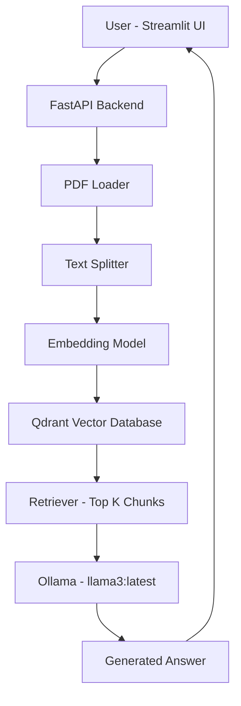
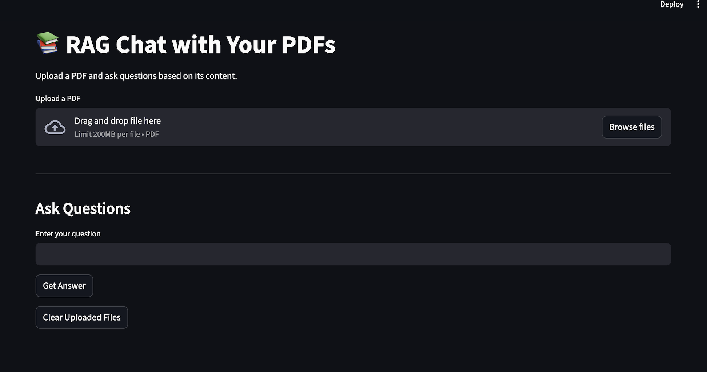
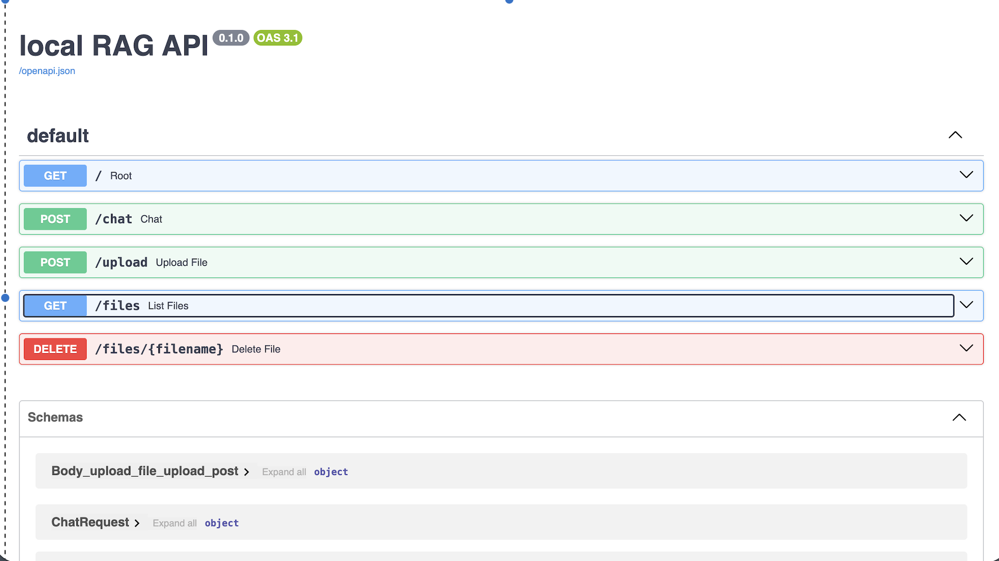

# 📚 RAG-Based Document Q&A API (LLaMA 3)

A production-ready Retrieval-Augmented Generation (RAG) system that enables users to upload PDF documents and ask context-aware questions using a fully local LLM.

This project integrates **FastAPI, Streamlit, LangChain, Qdrant, and Ollama (LLaMA 3)** to build a scalable, local-first document question-answering system.

---

## 🚀 Features

- 📄 Upload and index PDF documents
- 🔎 Semantic search using vector embeddings (Qdrant)
- 🧠 Context-aware answer generation using **LLaMA 3 (Ollama)**
- 💬 ChatGPT-style interactive UI (Streamlit)
- ⚡ FastAPI backend for scalable API usage
- 🔐 Fully local LLM setup (No OpenAI dependency)
- 🧩 Clean modular architecture

---

## 🏗 System Architecture



## 📂 Project Structure

```text
rag_project/
│
├── rag_agent.py      # RAG retrieval + generation logic
├── index.py          # PDF ingestion & vector indexing
├── main.py           # FastAPI entry point
│
├── UI/
│   └── app.py        # Streamlit Chat Interface
│
├── uploads/          # Uploaded PDF documents
├── requirements.txt  # Project dependencies
└── README.md         # Project documentation
```

---

## ⚙️ Installation Guide

### 1️⃣ Clone the Repository

```bash
git clone https://github.com/Anuj0333/RAG-based-document-Q-A-API.git
cd RAG-based-document-Q-A-API
```
---

## 📸 Screenshots

### Chat Interface


### API Interface

