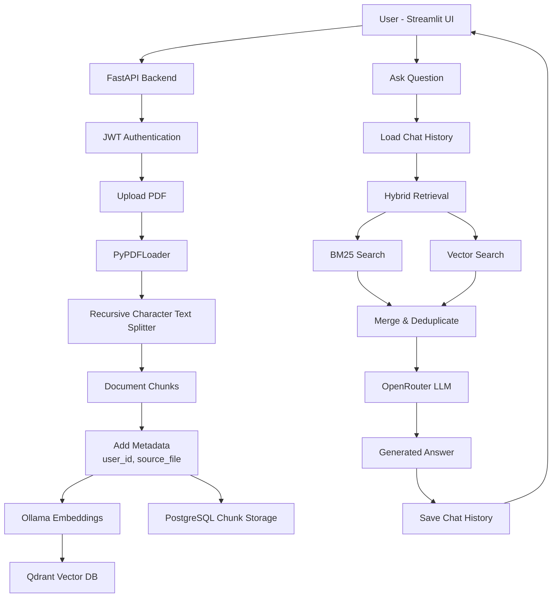
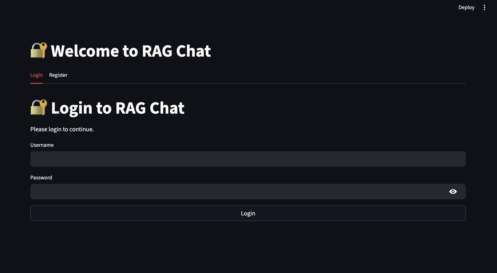
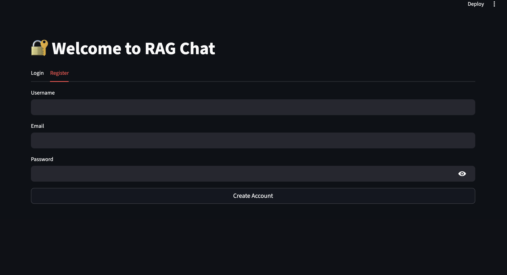
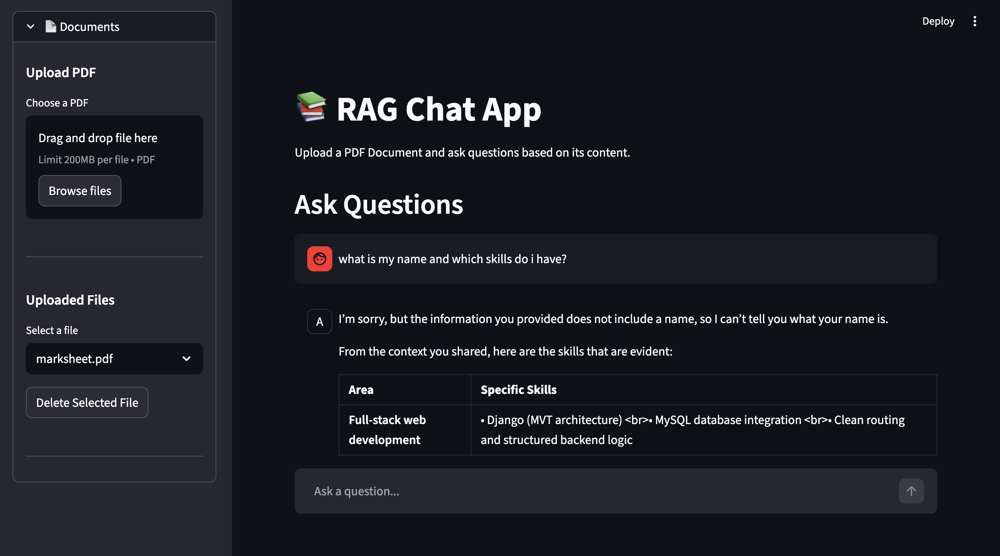
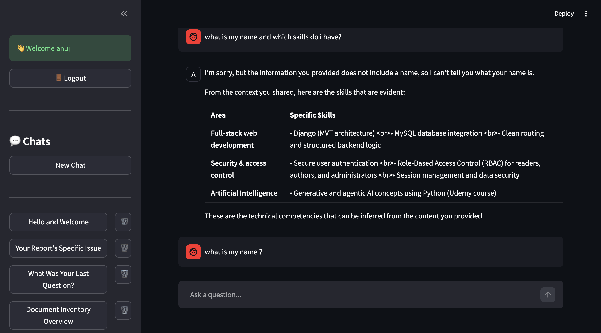
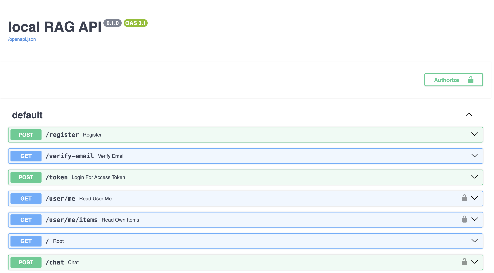
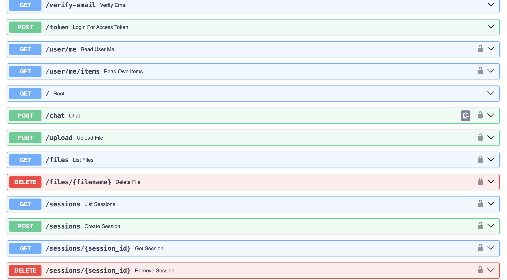

# 📚 Hybrid RAG Chat Application

A production-ready **Hybrid Retrieval-Augmented Generation (RAG)** application that enables users to upload PDF documents and ask context-aware questions using **semantic search + keyword search** with a fully local embedding pipeline.

The application combines **FastAPI, Streamlit, PostgreSQL, Qdrant, BM25, LangChain, Ollama, and OpenRouter** to provide secure multi-user document question answering.

---

# 🚀 Features

- 🔐 JWT-based user authentication
- 👤 Multi-user document isolation
- 📄 Upload and index PDF documents
- 🧩 Automatic document chunking
- 🔍 Hybrid Retrieval
  - Semantic Search (Qdrant)
  - Keyword Search (BM25)
- 🧠 Context-aware response generation using OpenRouter LLM
- 💬 ChatGPT-style Streamlit interface
- 📝 Chat history with automatic title generation
- 🗑 Delete uploaded documents from:
  - Local storage
  - PostgreSQL
  - Qdrant
- ⚡ FastAPI REST API
- 🐳 Docker & Docker Compose support
- 🔄 BM25 cache invalidation on upload/delete

---

# 🏗 System Architecture


```mermaid
flowchart TD

A[User - Streamlit UI]

A --> B[FastAPI Backend]

B --> C[JWT Authentication]

C --> D[Upload PDF]

D --> E[PyPDFLoader]

E --> F[Recursive Character Text Splitter]

F --> G[Document Chunks]

G --> H[Add Metadata<br/>user_id, source_file]

H --> I[Ollama Embeddings]

I --> J[Qdrant Vector DB]

H --> K[PostgreSQL Chunk Storage]

A --> L[Ask Question]

L --> M[Load Chat History]

M --> N[Hybrid Retrieval]

N --> O[BM25 Search]

N --> P[Vector Search]

O --> Q[Merge & Deduplicate]

P --> Q

Q --> R[OpenRouter LLM]

R --> S[Generated Answer]

S --> T[Save Chat History]

T --> A
```

---

# 🛠 Tech Stack

| Layer | Technology |
|--------|------------|
| Frontend | Streamlit |
| Backend | FastAPI |
| Authentication | JWT |
| Database | PostgreSQL |
| Vector Database | Qdrant |
| ORM | SQLAlchemy |
| Embeddings | Ollama (nomic-embed-text) |
| LLM | OpenRouter (GPT-OSS-20B) |
| Keyword Retrieval | BM25 (rank-bm25) |
| Semantic Retrieval | Qdrant Similarity Search |
| Framework | LangChain |
| Containerization | Docker & Docker Compose |

---

# 🔄 Upload Pipeline

```text
User Uploads PDF
        │
        ▼
FastAPI Upload API
        │
        ▼
PyPDFLoader
        │
        ▼
RecursiveCharacterTextSplitter
        │
        ▼
Chunks
        │
        ├────────► Add Metadata
        │             • user_id
        │             • source_file
        │
        ├────────► Generate Embeddings
        │             (Ollama)
        │
        ├────────► Store in Qdrant
        │
        └────────► Store Chunks
                     PostgreSQL
```

---

# 💬 Query Pipeline

```text
User Question
      │
      ▼
Load Chat History
      │
      ▼
Hybrid Retrieval
      │
      ├───────────────┐
      ▼               ▼
BM25 Search      Vector Search
(PostgreSQL)      (Qdrant)
      │               │
      └───────┬───────┘
              ▼
Merge & Deduplicate
              │
              ▼
Retrieved Context
              │
              ▼
OpenRouter LLM
              │
              ▼
Generated Answer
              │
              ▼
Save Chat History
              │
              ▼
Return Response
```

---

# 📂 Project Structure

```text
rag_project/
│
├── backend/
│   ├── main.py
│   ├── rag_agent.py
│   ├── index.py
│   ├── file_deletion.py
│   │
│   └── database/
│       ├── database.py
│       ├── models.py
│       └── curd.py
│
├── UI/
│   └── fastapi_app.py
│
├── uploads/
│
├── logs/
│
├── Dockerfile
├── docker-compose.yml
├── requirements.txt
└── README.md
```

---

# 🚀 Key Features

- User Authentication
- Multi-user Chat Sessions
- Persistent Chat History
- Automatic Chat Title Generation
- Hybrid Retrieval (BM25 + Semantic Search)
- User-specific Vector Filtering
- User-specific BM25 Index
- PDF Upload & Indexing
- Document Deletion
- Dockerized Deployment
- Modular Backend Architecture

---

# ⚙️ Installation

## Clone Repository

```bash
git clone https://github.com/Anuj0333/RAG-based-document-Q-A-API.git
cd RAG-based-document-Q-A-API
```

## Install Dependencies

```bash
pip install -r requirements.txt
```

## Run Backend

```bash
uvicorn backend.main:app --reload
```

## Run Frontend

```bash
streamlit run UI/fastapi_app.py
```

---

# 🐳 Docker Deployment

```bash
docker compose up --build
```

---

# 📸 Screenshots

## Streamlit Chat Interface




---

## FastAPI Backend



---

# 🔮 Future Improvements

- Hybrid score weighting (BM25 + Vector)
- Cross-Encoder Re-ranking
- Multi-file retrieval ranking
- Streaming LLM responses
- OCR support for scanned PDFs
- Image and table extraction
- Support for DOCX, TXT, CSV, and Markdown
- Admin dashboard
- Conversation export
- Redis caching
- Async ingestion pipeline
- Kubernetes deployment
- CI/CD with GitHub Actions

---

# 👨‍💻 Author

**Anuj Kumar Gupta**

AI Engineer | Machine Learning | FastAPI | LangChain | RAG | Vector Databases | LLM Applications
